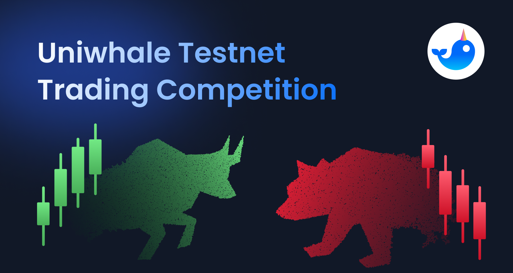

# Testnet Trading Competition

<figure><figcaption></figcaption></figure>

**Start date**: January 30, 2023

**Duration**: 2 Weeks

## Rules: 

* Get your trading funds from the Uniwhale [Testnet Faucet](broken-reference) page.
* No registration or KYC required to participate in the competition. Simply use the [Uniwhale Testnet](https://app.testnet.uniwhale.co/).
* There will be a number of trading sessions over the two weeks and you can participate in as many as you like.
* Each trading session lasts 48 hours, with the starting time of each session announced on [Discord](http://discord.gg/Uniwhale).
* You will be a winner for a trading session, if your session ROE (net PnL over margin used) is in the top 3!

## Rewards: 

* The first-placed winner receives 50U.
* The second-placed winner receives 30U.
* The third-placed winner receives 20U.
* The winners will receive airdrop boosts at the **Uniwhale** **Mainnet Airdrop Event**.
* The winners will also receive the **Uniwhale Genesis Pass whitelist.**
* If two addresses have the same ROE, the address with higher trading volume ranks higher.

## Rewards and Announcement Time: 

* **Start Time + 48 hours = End Time**\
  Please note only those trades opened after Start Time will count.\
  All open position will be automatically closed at End Time.
* After each trading session, we will announce the session results together with the new session time on the Discord Announcement channel and distribute rewards.
* The winners’ airdrop boost points will be automatically accumulated on the Airdrop Dashboard (coming soon).
* The winners can claim NFT whitelist on [Discord](http://discord.gg/Uniwhale). Please note the whitelist can be claimed only once.
