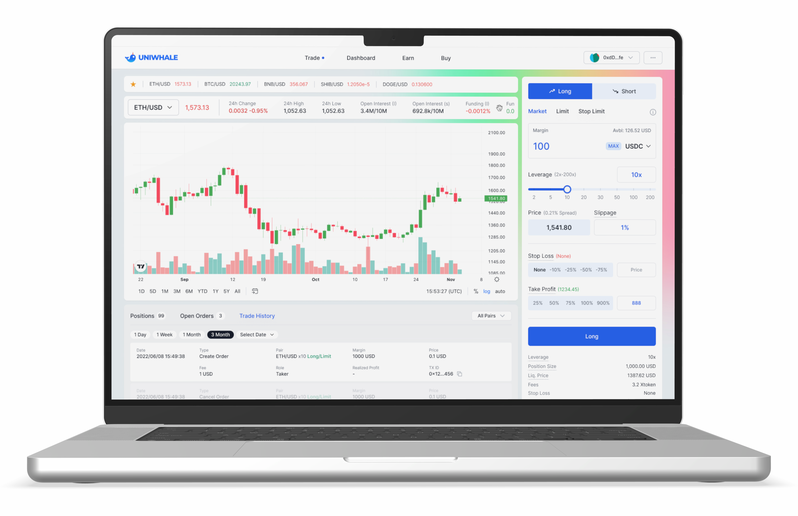

# Trading

<figure><figcaption></figcaption></figure>

## Trade up to 200X

We offer perpetual futures with up to 200X leverage on BTC, ETH, and many mainstream crypto assets.

## Keep your assets safe

We do not custody your assets. Your assets stay with you and the margins posted are locked in a dedicated smart contract.

## Margining

All positions are margined in USDC. Both isolated and portfolio margining will be supported.&#x20;

You can add margins to outstanding positions, but cannot partially withdraw posted margins. When margins are added to an outstanding position, the relevant liquidation price is adjusted.

Multiple stablecoins are accepted as eligible margins. These will be swapped automatically to USDC.

## Order type supported

You can trade either Market Order or Market Limit Order. Both order types can also have either Stop Loss, Profit Target, or both.

### Market Order

Market orders are filled at the best price offered by the [Liquidity Pool](liquidity-pool.md).

### Market Limit Order

Market limit orders are filled when the limit prices match the best price offered by the [Liquidity Pool](liquidity-pool.md).

### Stop Loss

Stop Loss price can be added to Market Order or Market Limit Order, which will trigger an automatic close of the position if the condition is satisfied.

### Profit Target

Profit Target price can be added to the Market Order or Market Limit Order, which will trigger an automatic close of the position if the condition is satisfied.

## Fee and Market Impact

Prices offered by the [Liquidity Pool](liquidity-pool.md) embed two types of transaction costs - Fee and Market Impact.

**Long/Short Open Price** = Oracle Price x (1 +/- Fee +/- Market Impact)

**Long/Short Close Price** = Oracle Price x (1 -/+ Fee -/+ Market Impact)

### Fee

Fee is \[.  ]%.

### Market Impact

Market Impact is calculated dynamically as a function of outstanding positions on the platform and the position size. It is a deterministic charge simulating the impact a new position would have on the market.

Market Impact (%) = (long/short outstanding positions on the platform + Position size) / 1% depth above/below

"1% depth above/below" is $\[.  ].

## Opening a position

Opening a position will transfer the required margin to a dedicated on-chain contract, whose sole purpose is to hold trader margins.

[Liquidity Pool](liquidity-pool.md) which acts as the central counterparty and clearinghouse to all positions.

The initial margin is calculated based on the matched prices ("Mark Price").

You can post margin in many stablecoins, which will then be automatically swapped into USDC.

## Closing a position

Closing a position will calculate the PnL based on the best price offered by the Liquidity Pool and transfer it to the trader, together with the margin posted.&#x20;

A trader may request the PnL to be transferred in a stablecoin other than USDC, in which case the PnL (together with the margin) will be swapped into the requested stablecoin and transferred to the trader.

A trader can not lose more than the margin posted.&#x20;

## Liquidation

Outstanding positions are subject to liquidation if the relevant liquidation price is breached according to the price oracle ("Index Price").

Outstanding positions eligible for liquidation are liquidated at the earliest chance, to protect the users and the platform.

Liquidation closes the relevant position. It is subject to a liquidation penalty. In order to avoid the liquidation penalty, traders are advised to close a position before liquidation is triggered.

## Risk management

Trading at uniwhale is subject to the following constraints:

* Leverage cannot exceed 200x.
* A trader can carry at most \[. ] open positions for each pair.
* A trader can carry at most \[. ] open positions across pairs.
* A trader can carry at most $\[.  ] of margin across pairs.
* Minimum position (after leverage) is $\[.  ].
* A position has the maximum percentage PnL of \[.  ].

