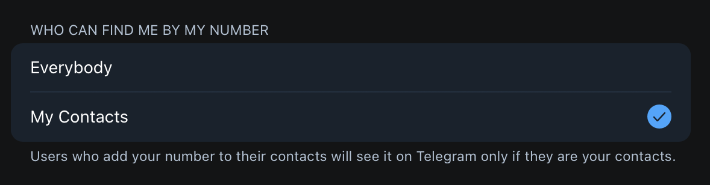

# Unique Oracle Design

<figure><figcaption></figcaption></figure>

## Mitigate harmful candlestick wicks&#x20;

Uniwhale does not require active market making by market makers, but instead relies on oracle prices to execute trades.

Oracle-based trade execution is designed specifically to mitigate harmful candlestick wicks, which so often liquidates, often unfairly, perpetual futures traders.

<figure><figcaption>
Harmful candlestick wicks can wipe out levered long/short positions right before a significant rally/drop
</figcaption></figure>

Such harmful wicks can be caused by many factors, but mainly we are concerned that these are often the result of illiquid/wrong/manipulated prices/pricing sources.

Oracle-based trade execution mitigates such harmful candlestick wicks because the oracle prices are published based on aggregate data contributed by multiple data sources. This makes it almost impossible to create such illiquid/wrong/manipulated prices/pricing sources-driven wicks.

Uniwhale is currently using [Pyth Network](https://pyth.network) for its oracle prices. Pyth Network is an oracle that publishes financial market data to multiple blockchains. Market data is contributed by over 70 [first-party publishers](https://pyth.network/publishers/), including some of the biggest exchanges and market making firms in the world. Each price feed publishes a [robust aggregate](https://docs.pyth.network/how-pyth-works/price-aggregation) of publisher prices that updates multiple times per second.

As part of its product roadmap, uniwhale will be migrating to an custom-built oracle aggregator based on multiple service providers (including Pyth) to determine trading prices.

By aggregating and filtering oracle prices across multiple service providers, our oracle aggregator can provide an oracle price that reflects event better the true market activities.

